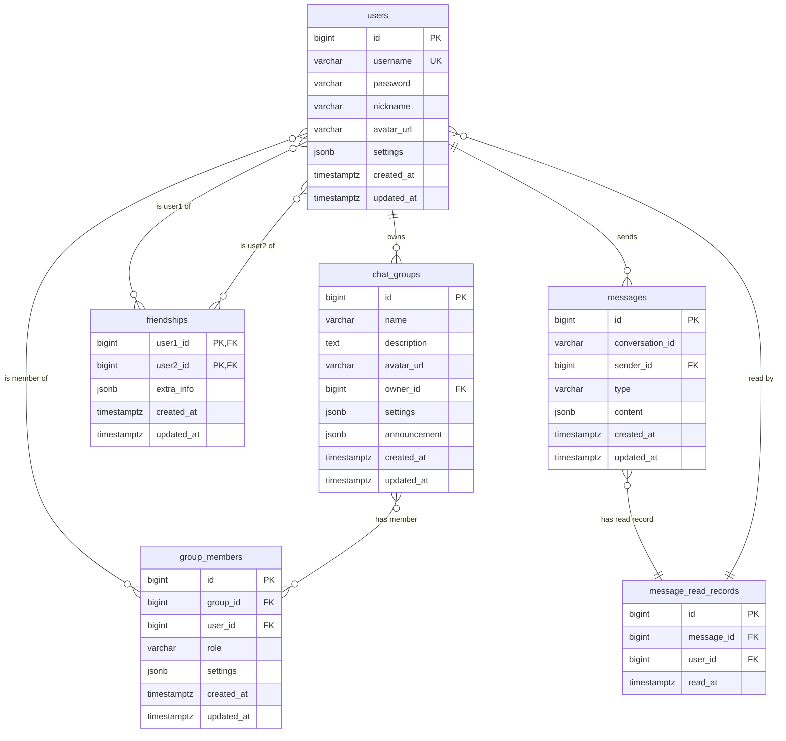

# 数据库设计

## 5.1 数据库选型

### PostgreSQL 15+

**选择理由**：

- 开源、免费、社区活跃
- 支持高级数据类型和功能
- 性能稳定，适合高并发场景
- 支持JSON、全文检索等现代功能
- 提供强大的事务支持和数据完整性保证

## 5.2 数据表设计

## 5.3 数据库优化策略

1. **索引优化**：
   - 为所有外键和常用查询字段创建索引
   - 为消息表的时间字段创建索引，便于按时间查询历史消息
   - 为用户表的在线状态创建索引，便于快速查询在线用户

2. **分区策略**：
   - 消息表可以按时间进行分区，提高查询性能
   - 文件表可以按用户ID进行分区，便于管理用户文件

3. **缓存策略**：
   - 使用Redis缓存用户会话和在线状态
   - 缓存常用查询结果，如好友列表、群组列表
