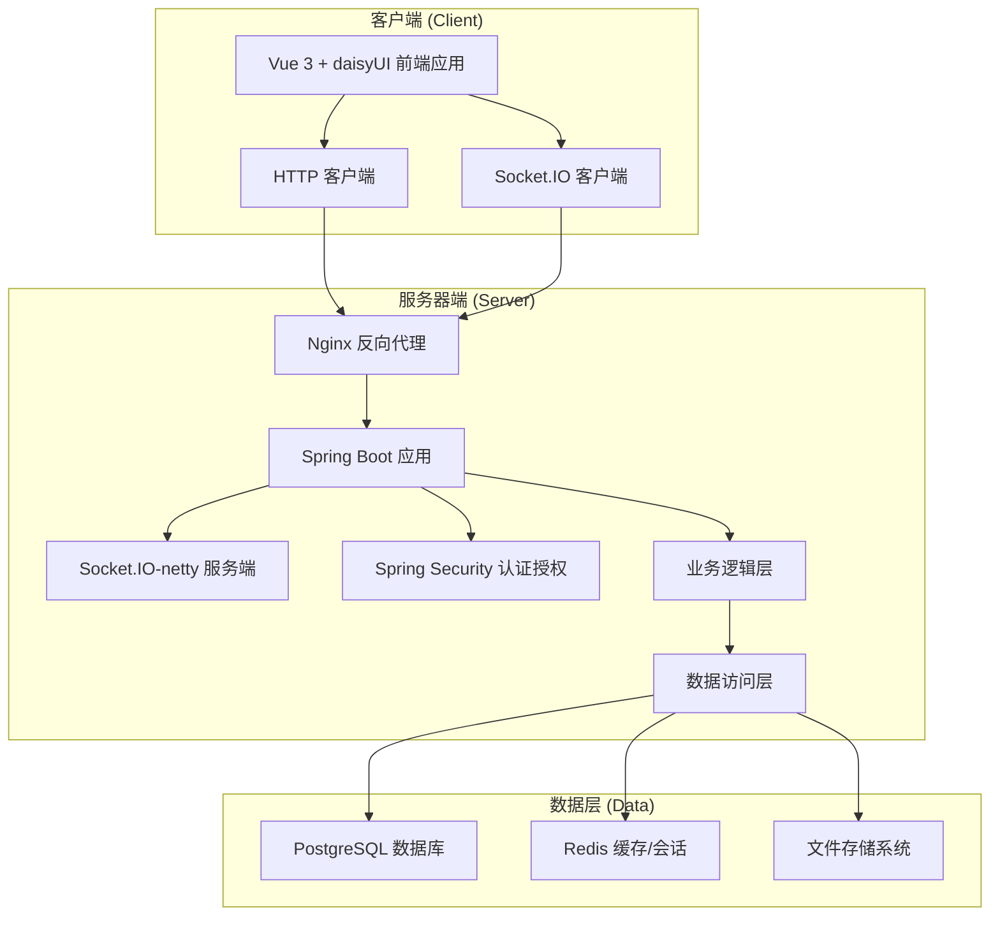
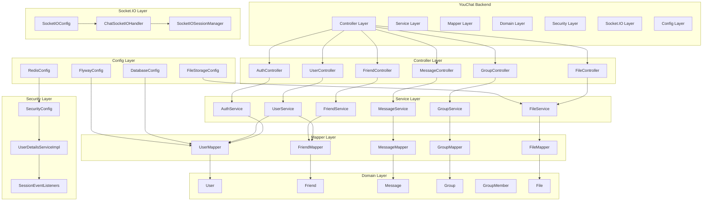
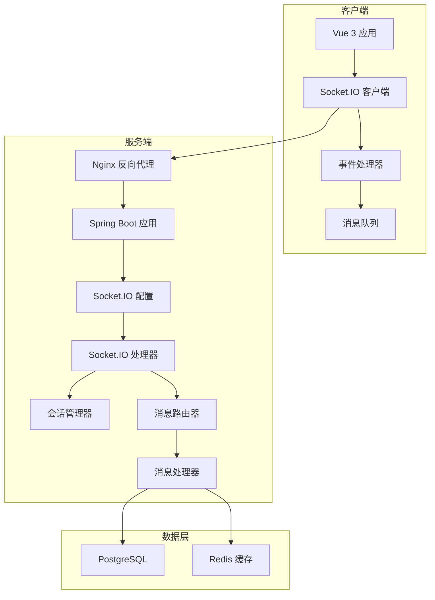
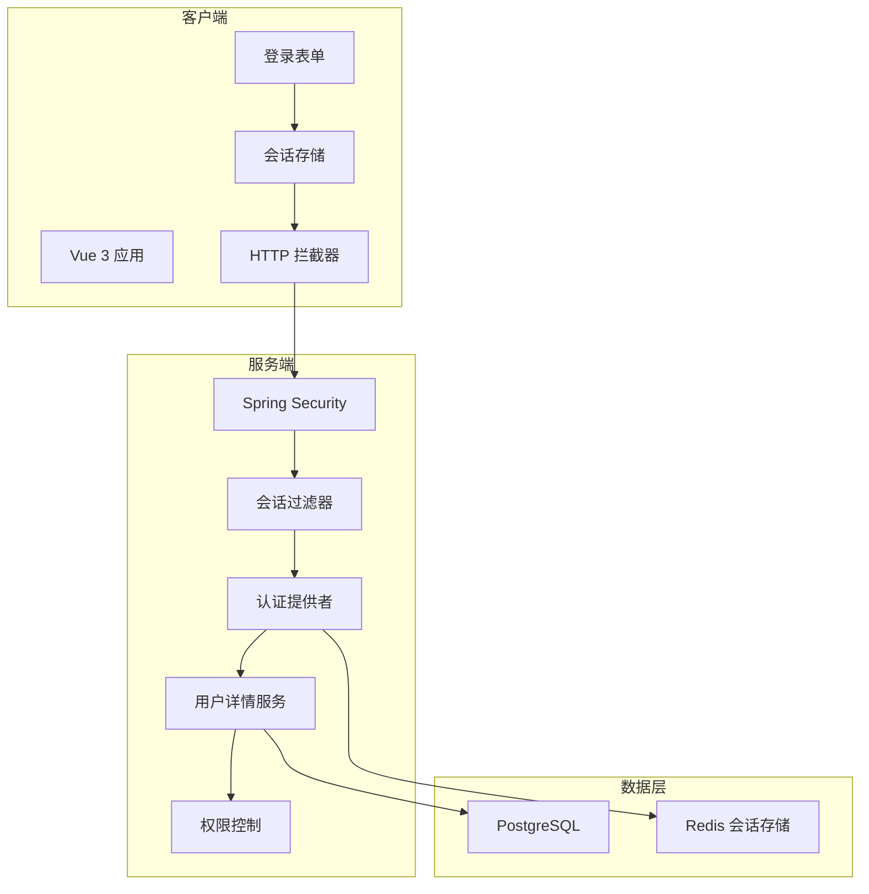
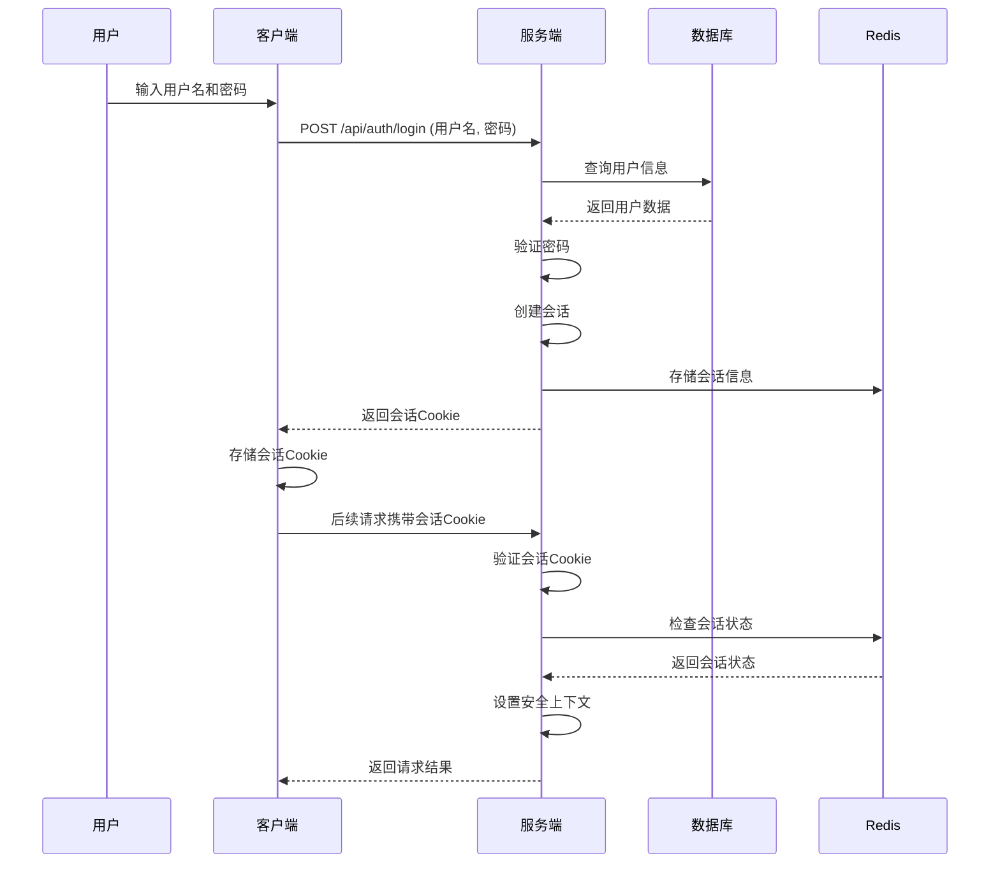

# YouChat 技术选型与架构设计报告

## 文档信息

| 项目名称 | YouChat：简易在线互动聊天系统 |
| :--- | :--- |
| 项目版本 | V1.0 |
| 文档版本 | V1.0 |
| 编写人 | 技术架构团队 |
| 完成日期 | 2025年9月16日 |

---

## 1. 概述

### 1.1 项目背景

YouChat是一个基于Web的即时通讯系统，作为微信（WeChat）的简化克隆版。本项目旨在为用户提供一个稳定、可靠、用户友好的在线聊天平台，支持用户管理、好友管理、一对一通信、群组聊天和文件传输等核心功能。

### 1.2 技术选型原则

本技术选型遵循以下原则：

1. **技术成熟度**：选择成熟、稳定的技术栈，确保系统可靠性
2. **开发效率**：选择能够提高开发效率的工具和框架
3. **可扩展性**：系统架构应支持未来功能扩展和性能提升
4. **安全性**：采用业界公认的安全最佳实践
5. **成本效益**：优先选择开源技术，降低项目成本
6. **团队熟悉度**：考虑团队对技术的熟悉程度，降低学习成本

### 1.3 技术偏好

根据需求分析，本项目的技术偏好如下：

- **后端框架**：Spring Boot
- **前端框架**：Vue.js
- **UI组件库**：daisyUI
- **数据库**：PostgreSQL

---

## 2. 系统架构设计

### 2.1 总体架构

YouChat采用前后端分离的C/S（客户端/服务器）架构，具体设计如下：



### 2.2 架构特点

1. **前后端分离**：前端使用Vue 3 + daisyUI，后端使用Spring Boot，通过RESTful API和Socket.IO进行通信
2. **模块化设计**：系统分为用户管理、好友管理、消息管理、群组管理、文件管理等模块
3. **实时通信**：使用Socket.IO实现实时消息推送
4. **安全架构**：使用Spring Sessions + Spring Security实现认证授权
5. **数据持久化**：使用PostgreSQL存储关系型数据，Redis用于会话管理和缓存，文件系统存储上传的文件

### 2.3 技术栈概览

| 层次 | 技术选型 | 说明 |
| :--- | :--- | :--- |
| 前端 | Vue 3 + daisyUI | 现代化的前端框架和UI组件库 |
| 后端 | Spring Boot 3.2.x | 企业级Java应用框架 |
| 数据库 | PostgreSQL 15+ | 开源关系型数据库 |
| 缓存/会话 | Redis 7.0+ | 内存数据库，用于缓存和会话管理 |
| 实时通信 | Socket.IO-netty | 实现双向通信的框架 |
| 安全认证 | Spring Sessions + Spring Security | 基于会话的认证授权机制 |
| 构建工具 | Maven | Java项目构建和依赖管理 |
| 数据库迁移 | Flyway | 数据库版本控制和迁移 |
| 环境管理 | direnv | 环境变量管理 |
| 部署 | Docker + Nginx | 容器化部署和反向代理 |

---

## 3. 后端技术选型

### 3.1 核心框架

#### Spring Boot 3.2.x

**选择理由**：

- 简化Spring应用开发，提供自动配置功能
- 内嵌Web服务器（Tomcat），简化部署
- 丰富的生态系统和社区支持
- 与Spring生态系统无缝集成

**主要依赖**：

```xml
<!-- Spring Boot Starter -->
<dependency>
    <groupId>org.springframework.boot</groupId>
    <artifactId>spring-boot-starter-web</artifactId>
</dependency>

<!-- Spring Security -->
<dependency>
    <groupId>org.springframework.boot</groupId>
    <artifactId>spring-boot-starter-security</artifactId>
</dependency>

<!-- Spring Session with Redis -->
<dependency>
    <groupId>org.springframework.session</groupId>
    <artifactId>spring-session-data-redis</artifactId>
</dependency>

<!-- MyBatis -->
<dependency>
    <groupId>org.mybatis.spring.boot</groupId>
    <artifactId>mybatis-spring-boot-starter</artifactId>
    <version>3.0.3</version>
</dependency>

<!-- MyBatis Dynamic SQL -->
<dependency>
    <groupId>org.mybatis.dynamic-sql</groupId>
    <artifactId>mybatis-dynamic-sql</artifactId>
    <version>1.5.0</version>
</dependency>

<!-- Socket.IO-netty -->
<dependency>
    <groupId>io.socket</groupId>
    <artifactId>socket.io-netty</artifactId>
    <version>2.0.12</version>
</dependency>

<!-- Flyway -->
<dependency>
    <groupId>org.flywaydb</groupId>
    <artifactId>flyway-core</artifactId>
</dependency>
```

### 3.2 数据访问层

#### MyBatis Dynamic SQL

**选择理由**：

- 提供类型安全的SQL构建
- 支持动态SQL生成，减少样板代码
- 更好的SQL控制，便于优化
- 与Spring Boot无缝集成

#### PostgreSQL 15+

**选择理由**：

- 开源、免费、社区活跃
- 支持高级数据类型和功能
- 性能稳定，适合高并发场景
- 支持JSON、全文检索等现代功能

### 3.3 数据库迁移

#### Flyway

**选择理由**：

- 数据库版本控制和迁移工具
- 支持多种数据库
- 提供清晰的迁移历史
- 与Spring Boot无缝集成

### 3.4 缓存与会话管理

#### Redis 7.0+

**选择理由**：

- 高性能内存数据库
- 支持多种数据结构
- 可用于缓存、会话管理、消息队列等
- 支持持久化和集群

#### Spring Sessions with Redis

**选择理由**：

- 提供集群环境下的会话管理
- 与Spring Security无缝集成
- 支持多种会话存储后端
- 提供会话事件监听

### 3.5 安全框架

#### Spring Security + Spring Sessions

**选择理由**：

- 提供全面的安全解决方案
- 支持多种认证和授权机制
- 与Spring生态系统无缝集成
- Spring Sessions提供集群环境下的会话管理

### 3.6 实时通信

#### Socket.IO-netty

**选择理由**：

- 支持WebSocket和长轮询降级
- 自动重连机制
- 事件驱动的API
- 良好的兼容性
- 基于Netty，性能优秀

### 3.7 构建工具

#### Maven

**选择理由**：

- Java项目标准的构建工具
- 丰富的插件生态系统
- 依赖管理和项目生命周期管理
- 与IDE集成良好

### 3.8 后端模块设计



---

## 4. 前端技术选型

### 4.1 核心框架

#### Vue 3.3.x

**选择理由**：

- 现代化的前端框架，性能优秀
- 组合式API提供更好的逻辑复用
- 丰富的生态系统和社区支持
- 学习曲线平缓，开发效率高

### 4.2 状态管理

#### Pinia 2.1.x

**选择理由**：

- Vue官方推荐的状态管理库
- 简单直观的API设计
- 支持TypeScript
- 轻量级，无冗余代码

### 4.3 路由管理

#### Vue Router 4.2.x

**选择理由**：

- Vue官方路由管理器
- 支持嵌套路由、动态路由
- 与Vue 3完美集成
- 提供导航守卫等高级功能

### 4.4 HTTP客户端

#### openapi-fetch (基于原生fetch)

**选择理由**：

- 基于原生fetch API，无需额外依赖
- 类型安全的API客户端，支持TypeScript
- 自动生成API客户端代码
- 支持请求和响应拦截
- 良好的浏览器兼容性

### 4.5 UI组件库

#### daisyUI 4.4.x + Tailwind CSS 3.3.x

**选择理由**：

- 基于Tailwind CSS的组件库
- 提供丰富的预构建组件
- 支持主题定制
- 轻量级，无需额外JavaScript

### 4.6 实时通信

#### socket.io-client 4.7.x

**选择理由**：

- 与服务端Socket.IO-netty完美匹配
- 支持WebSocket和长轮询降级
- 自动重连机制
- 事件驱动的API
- 良好的兼容性

### 4.7 前端模块设计

```mermaid
graph TB
    subgraph "YouChat Frontend"
        A[Views]
        B[Components]
        C[Stores]
        D[Services]
        E[Utils]
        F[Assets]
    end
    
    subgraph "Views"
        A1[LoginView]
        A2[RegisterView]
        A3[ChatView]
        A4[ProfileView]
        A5[NotFoundView]
    end
    
    subgraph "Components"
        B1[Layout Components]
        B2[Form Components]
        B3[Chat Components]
        B4[UI Components]
    end
    
    subgraph "Layout Components"
        B11[NavBar]
        B12[SideBar]
        B13[MainLayout]
    end
    
    subgraph "Form Components"
        B21[LoginForm]
        B22[RegisterForm]
        B23[SearchInput]
    end
    
    subgraph "Chat Components"
        B31[MessageList]
        B32[MessageItem]
        B33[MessageInput]
        B34[FriendList]
        B35[GroupList]
        B36[FileUpload]
    end
    
    subgraph "UI Components"
        B41[Avatar]
        B42[Button]
        B43[Modal]
        B44[Notification]
    end
    
    subgraph "Stores"
        C1[AuthStore]
        C2[UserStore]
        C3[ChatStore]
        C4[GroupStore]
        C5[UIStore]
    end
    
    subgraph "Services"
        D1[AuthService]
        D2[UserService]
        D3[FriendService]
        D4[MessageService]
        D5[GroupService]
        D6[FileService]
        D7[SocketIOService]
    end
    
    subgraph "Utils"
        E1[DateUtils]
        E2[ValidationUtils]
        E3[FileUtils]
        E4[SocketIOUtils]
    end
    
    subgraph "Assets"
        F1[Images]
        F2[Icons]
        F3[Styles]
    end
    
    A --> A1
    A --> A2
    A --> A3
    A --> A4
    A --> A5
    
    B --> B1
    B --> B2
    B --> B3
    B --> B4
    
    B1 --> B11
    B1 --> B12
    B1 --> B13
    
    B2 --> B21
    B2 --> B22
    B2 --> B23
    
    B3 --> B31
    B3 --> B32
    B3 --> B33
    B3 --> B34
    B3 --> B35
    B3 --> B36
    
    B4 --> B41
    B4 --> B42
    B4 --> B43
    B4 --> B44
    
    C --> C1
    C --> C2
    C --> C3
    C --> C4
    C --> C5
    
    D --> D1
    D --> D2
    D --> D3
    D --> D4
    D --> D5
    D --> D6
    D --> D7
    
    E --> E1
    E --> E2
    E --> E3
    E --> E4
    
    F --> F1
    F --> F2
    F --> F3
```



---

## 5. 数据库设计

[Database](database.md)

---

## 6. 实时通信技术方案

### 6.1 Socket.IO架构设计



### 6.2 消息类型设计

前端定义的消息类型包括：

```javascript
// 连接相关
CONNECT: 'connect'
DISCONNECT: 'disconnect'
PING: 'ping'
PONG: 'pong'

// 用户状态
USER_ONLINE: 'user_online'
USER_OFFLINE: 'user_offline'

// 私聊消息
PRIVATE_MESSAGE: 'private_message'
PRIVATE_MESSAGE_READ: 'private_message_read'

// 群聊消息
GROUP_MESSAGE: 'group_message'
GROUP_MESSAGE_READ: 'group_message_read'

// 好友相关
FRIEND_REQUEST: 'friend_request'
FRIEND_ACCEPT: 'friend_accept'
FRIEND_REJECT: 'friend_reject'
FRIEND_REMOVE: 'friend_remove'

// 群组相关
GROUP_INVITE: 'group_invite'
GROUP_JOIN: 'group_join'
GROUP_LEAVE: 'group_leave'
GROUP_KICK: 'group_kick'

// 文件相关
FILE_UPLOAD: 'file_upload'
FILE_DOWNLOAD: 'file_download'

// 错误处理
ERROR: 'error'
```

### 6.3 Socket.IO连接管理

#### 连接生命周期

1. **建立连接**：
   - 客户端发送Socket.IO连接请求
   - 服务端验证会话有效性
   - 验证通过后建立连接，并注册用户会话

2. **保持连接**：
   - 客户端定期发送心跳消息（ping）
   - 服务端响应心跳消息（pong）
   - 如果长时间没有心跳，服务端主动断开连接

3. **重连机制**：
   - 客户端检测到连接断开后，自动尝试重连
   - 采用指数退避算法，避免频繁重连
   - 达到最大重试次数后停止重连

#### 连接安全

1. **认证机制**：
   - 使用Spring Sessions进行身份认证
   - 每个Socket.IO连接都需要有效的会话
   - 会话过期后需要重新认证

2. **授权机制**：
   - 基于用户角色的访问控制
   - 用户只能访问自己的消息和好友信息
   - 群组成员只能访问所在群组的信息

3. **数据加密**：
   - 使用WSS协议（WebSocket Secure）加密传输
   - 敏感数据在传输前进行加密

---

## 7. 安全架构设计

### 7.1 安全架构概览



### 7.2 Spring Sessions认证流程



### 7.3 安全实现策略

1. **密码安全**：
   - 使用BCryptPasswordEncoder对密码进行哈希加盐处理
   - 密码强度验证（最小长度、复杂度要求）
   - 定期要求用户更改密码

2. **会话安全**：
   - 使用Spring Sessions管理用户会话
   - 设置合理的会话超时时间
   - 实现会话固定保护
   - 支持会话并发控制

3. **传输安全**：
   - 使用HTTPS协议加密所有通信
   - 敏感数据在传输前进行额外加密
   - 实现CORS策略，限制跨域访问

4. **输入验证**：
   - 对所有用户输入进行验证和清理
   - 防止SQL注入攻击
   - 防止XSS（跨站脚本）攻击
   - 防止CSRF（跨站请求伪造）攻击

5. **会话管理**：
   - 实现会话超时机制
   - 记录用户登录活动
   - 支持强制注销用户
   - 实现会话事件监听

6. **权限控制**：
   - 基于角色的访问控制（RBAC）
   - 方法级别的权限控制
   - 资源级别的权限控制

---

## 8. 项目结构与模块化设计

### 8.1 整体项目结构

```
youchat/
├── backend/                    # Spring Boot后端项目
│   ├── src/
│   │   ├── main/
│   │   │   ├── java/
│   │   │   │   └── com/
│   │   │   │       └── youchat/
│   │   │   │           ├── YouChatApplication.java    # 应用程序入口
│   │   │   │           ├── config/                   # 配置类
│   │   │   │           ├── controller/               # 控制器
│   │   │   │           ├── service/                  # 服务层
│   │   │   │           ├── mapper/                   # MyBatis映射器
│   │   │   │           ├── model/                    # 实体类
│   │   │   │           ├── dto/                      # 数据传输对象
│   │   │   │           ├── security/                 # 安全相关
│   │   │   │           ├── socketio/                 # Socket.IO相关
│   │   │   │           ├── exception/                # 异常处理
│   │   │   │           ├── util/                     # 工具类
│   │   │   │           └── constant/                 # 常量定义
│   │   │   └── resources/
│   │   │       ├── application.yml                  # 应用配置
│   │   │       ├── application-dev.yml              # 开发环境配置
│   │   │       ├── application-prod.yml             # 生产环境配置
│   │   │       ├── db/migration/                    # Flyway迁移脚本
│   │   │       └── static/                          # 静态资源
│   │   └── test/                                     # 测试代码
│   ├── pom.xml                                       # Maven构建文件
│   ├── Dockerfile                                    # Docker配置
│   └── README.md                                     # 后端项目说明
│
├── frontend/                                           # Vue 3前端项目
│   ├── public/                                       # 公共资源
│   ├── src/
│   │   ├── assets/                                   # 静态资源
│   │   ├── components/                               # 组件
│   │   │   ├── layout/                              # 布局组件
│   │   │   ├── form/                                # 表单组件
│   │   │   ├── chat/                                # 聊天组件
│   │   │   └── ui/                                  # UI组件
│   │   ├── views/                                    # 页面视图
│   │   ├── stores/                                   # Pinia状态管理
│   │   ├── services/                                 # API服务
│   │   ├── utils/                                    # 工具函数
│   │   ├── constants/                                # 常量定义
│   │   ├── router/                                   # 路由配置
│   │   ├── App.vue                                   # 根组件
│   │   └── main.js                                   # 入口文件
│   ├── package.json                                  # npm配置
│   ├── vite.config.js                                # Vite配置
│   ├── tailwind.config.js                            # Tailwind配置
│   ├── postcss.config.js                             # PostCSS配置
│   ├── .eslintrc.js                                  # ESLint配置
│   ├── .prettierrc                                   # Prettier配置
│   ├── Dockerfile                                    # Docker配置
│   └── README.md                                     # 前端项目说明
│
├── docker/                                           # Docker相关配置
│   ├── docker-compose.yml                            # Docker Compose配置
│   ├── nginx/                                        # Nginx配置
│   │   └── nginx.conf
│   └── postgres/                                     # PostgreSQL配置
│       └── init.sql
│
├── docs/                                             # 项目文档
│   ├── api/                                          # API文档
│   ├── architecture/                                 # 架构文档
│   ├── deployment/                                   # 部署文档
│   └── user/                                         # 用户手册
│
├── .envrc                                            # direnv环境变量配置
├── .gitignore                                        # Git忽略文件
├── README.md                                         # 项目说明
└── LICENSE                                           # 许可证
```

### 8.2 模块化设计原则

1. **单一职责原则**：
   - 每个模块只负责一个明确的功能
   - 模块内部高内聚，模块间低耦合

2. **开闭原则**：
   - 对扩展开放，对修改关闭
   - 通过接口和抽象类实现扩展

3. **依赖倒置原则**：
   - 高层模块不依赖低层模块，都依赖抽象
   - 抽象不依赖细节，细节依赖抽象

4. **接口隔离原则**：
   - 使用多个专门的接口，而不是单一的总接口
   - 客户端不应该依赖它不需要的接口

5. **迪米特法则**：
   - 一个对象应该对其他对象保持最少的了解
   - 只与直接的朋友通信

### 8.3 模块化实现策略

1. **后端模块化策略**：
   - 使用Spring Boot的自动配置和条件化配置
   - 通过依赖注入实现模块间的松耦合
   - 使用AOP实现横切关注点的模块化

2. **前端模块化策略**：
   - 使用Vue 3的组合式API实现逻辑复用
   - 通过组件化实现UI的模块化
   - 使用Pinia实现状态的模块化管理

3. **跨模块通信**：
   - 后端使用事件驱动架构实现模块间通信
   - 前端使用事件总线或Pinia实现跨组件通信
   - 前后端通过RESTful API和Socket.IO进行通信

---

## 9. 开发与部署环境配置

### 9.1 开发环境配置

#### 后端开发环境

1. **Java开发环境**：
   - JDK 21 (OpenJDK或Oracle JDK)
   - Maven 3.8+
   - IDE: IntelliJ IDEA或VS Code

2. **数据库环境**：
   - PostgreSQL 15+
   - Redis 7.0+ (用于缓存和会话管理)
   - 数据库管理工具: DBeaver或pgAdmin

3. **开发工具**：
   - Git (版本控制)
   - Postman (API测试)
   - Docker (容器化开发)

#### 前端开发环境

1. **Node.js环境**：
   - Node.js 18+
   - npm 9+ 或 yarn 1.22+

2. **前端工具**：
   - Vue CLI或Vite
   - VS Code (推荐插件: Volar, Prettier, ESLint)
   - Chrome DevTools

3. **UI设计工具**：
   - Figma (UI设计)
   - Tailwind CSS IntelliSense (VS Code插件)

### 9.2 环境变量管理

#### direnv配置

```bash
# .envrc
# 数据库配置
export DB_HOST=localhost
export DB_PORT=5432
export DB_NAME=youchat
export DB_USER=youchat
export DB_PASSWORD=youchat

# Redis配置
export REDIS_HOST=localhost
export REDIS_PORT=6379
export REDIS_PASSWORD=redispassword

# 应用配置
export SERVER_PORT=8080
export SESSION_TIMEOUT=3600

# 文件上传配置
export FILE_UPLOAD_DIR=./uploads
export FILE_MAX_SIZE=10485760

# 域名配置
export DOMAIN=localhost
```

### 9.3 Docker配置

#### 后端Dockerfile

```dockerfile
# backend/Dockerfile
# 使用多阶段构建减少镜像大小

# 第一阶段：构建阶段
FROM eclipse-temurin:21-jdk-alpine AS builder
WORKDIR /app

# 复制Maven配置文件
COPY pom.xml .
COPY .mvn .mvn
COPY mvnw .

# 下载依赖
RUN chmod +x mvnw && ./mvnw dependency:go-offline -B

# 复制源代码
COPY src ./src

# 构建应用
RUN ./mvnw package -DskipTests -B

# 第二阶段：运行阶段
FROM eclipse-temurin:21-jre-alpine
WORKDIR /app

# 安装必要的包
RUN apk add --no-cache tzdata

# 设置时区
ENV TZ=Asia/Shanghai

# 从构建阶段复制JAR文件
COPY --from=builder /app/target/*.jar app.jar

# 创建非root用户
RUN addgroup -S spring && adduser -S spring -G spring
USER spring:spring

# 暴露端口
EXPOSE 8080

# 健康检查
HEALTHCHECK --interval=30s --timeout=3s --start-period=60s --retries=3 \
  CMD curl -f http://localhost:8080/actuator/health || exit 1

# 启动应用
ENTRYPOINT ["java", "-jar", "app.jar"]
```

#### Docker Compose配置

```yaml
# docker/docker-compose.yml
version: '3.8'

services:
  # PostgreSQL数据库
  postgres:
    image: postgres:15-alpine
    container_name: youchat-postgres
    environment:
      POSTGRES_DB: youchat
      POSTGRES_USER: youchat
      POSTGRES_PASSWORD: youchat
    volumes:
      - postgres_data:/var/lib/postgresql/data
      - ./postgres/init.sql:/docker-entrypoint-initdb.d/init.sql
    ports:
      - "5432:5432"
    networks:
      - youchat-network
    restart: unless-stopped

  # Redis缓存/会话
  redis:
    image: redis:7-alpine
    container_name: youchat-redis
    command: redis-server --requirepass redispassword
    volumes:
      - redis_data:/data
    ports:
      - "6379:6379"
    networks:
      - youchat-network
    restart: unless-stopped

  # 后端应用
  backend:
    build:
      context: ../backend
      dockerfile: Dockerfile
    container_name: youchat-backend
    environment:
      SPRING_PROFILES_ACTIVE: prod
      DB_HOST: postgres
      DB_PORT: 5432
      DB_NAME: youchat
      DB_USERNAME: youchat
      DB_PASSWORD: youchat
      REDIS_HOST: redis
      REDIS_PORT: 6379
      REDIS_PASSWORD: redispassword
      SERVER_PORT: 8080
      SESSION_TIMEOUT: 3600
      FILE_UPLOAD_DIR: /app/uploads
      FILE_MAX_SIZE: 10485760
    volumes:
      - file_uploads:/app/uploads
      - ../backend/logs:/app/logs
    ports:
      - "8080:8080"
    depends_on:
      - postgres
      - redis
    networks:
      - youchat-network
    restart: unless-stopped

  # 前端应用
  frontend:
    build:
      context: ../frontend
      dockerfile: Dockerfile
    container_name: youchat-frontend
    volumes:
      - ./nginx/nginx.conf:/etc/nginx/conf.d/default.conf
    ports:
      - "80:80"
    depends_on:
      - backend
    networks:
      - youchat-network
    restart: unless-stopped

  # Nginx反向代理
  nginx:
    image: nginx:alpine
    container_name: youchat-nginx
    volumes:
      - ./nginx/nginx.conf:/etc/nginx/nginx.conf
      - ./nginx/ssl:/etc/nginx/ssl
    ports:
      - "443:443"
    depends_on:
      - frontend
      - backend
    networks:
      - youchat-network
    restart: unless-stopped

volumes:
  postgres_data:
  redis_data:
  file_uploads:

networks:
  youchat-network:
    driver: bridge
```

### 9.4 部署环境配置

#### 生产环境部署

1. **生产环境Docker Compose**：
   - 使用环境变量配置敏感信息
   - 配置数据持久化
   - 设置资源限制

2. **direnv环境配置**：

   ```bash
   # .envrc
   # 数据库配置
   export DB_HOST=postgres
   export DB_PORT=5432
   export DB_NAME=youchat
   export DB_USER=youchat
   export DB_PASSWORD=${DB_PASSWORD}

   # Redis配置
   export REDIS_HOST=redis
   export REDIS_PORT=6379
   export REDIS_PASSWORD=${REDIS_PASSWORD}

   # 应用配置
   export SERVER_PORT=8080
   export SESSION_TIMEOUT=3600

   # 文件上传配置
   export FILE_UPLOAD_DIR=/app/uploads
   export FILE_MAX_SIZE=10485760

   # 域名配置
   export DOMAIN=your-domain.com
   ```

3. **生产环境部署脚本**：
   - 自动化构建和部署流程
   - 健康检查和回滚机制
   - 日志收集和监控

### 9.5 CI/CD配置

#### GitHub Actions配置

```yaml
# .github/workflows/ci.yml
name: CI/CD Pipeline

on:
  push:
    branches: [ main, develop ]
  pull_request:
    branches: [ main ]

jobs:
  test:
    runs-on: ubuntu-latest
    
    services:
      postgres:
        image: postgres:15
        env:
          POSTGRES_PASSWORD: postgres
        options: >-
          --health-cmd pg_isready
          --health-interval 10s
          --health-timeout 5s
          --health-retries 5
        ports:
          - 5432:5432

    steps:
    - uses: actions/checkout@v3

    - name: Set up JDK 21
      uses: actions/setup-java@v3
      with:
        java-version: '21'
        distribution: 'temurin'

    - name: Cache Maven packages
      uses: actions/cache@v3
      with:
        path: ~/.m2
        key: ${{ runner.os }}-maven-${{ hashFiles('**/pom.xml') }}
        restore-keys: |
          ${{ runner.os }}-maven-

    - name: Run backend tests
      run: mvn test
      working-directory: backend
      env:
        POSTGRES_HOST: localhost
        POSTGRES_PORT: 5432
        POSTGRES_DB: youchat_test
        POSTGRES_USER: postgres
        POSTGRES_PASSWORD: postgres

    - name: Set up Node.js
      uses: actions/setup-node@v3
      with:
        node-version: '18'
        cache: 'npm'
        cache-dependency-path: frontend/package-lock.json

    - name: Install frontend dependencies
      run: npm ci
      working-directory: frontend

    - name: Run frontend tests
      run: npm run test:unit
      working-directory: frontend

    - name: Run frontend lint
      run: npm run lint
      working-directory: frontend

  build-and-deploy:
    needs: test
    runs-on: ubuntu-latest
    if: github.ref == 'refs/heads/main'

    steps:
    - uses: actions/checkout@v3

    - name: Set up JDK 21
      uses: actions/setup-java@v3
      with:
        java-version: '21'
        distribution: 'temurin'

    - name: Set up Node.js
      uses: actions/setup-node@v3
      with:
        node-version: '18'
        cache: 'npm'
        cache-dependency-path: frontend/package-lock.json

    - name: Configure AWS credentials
      uses: aws-actions/configure-aws-credentials@v2
      with:
        aws-access-key-id: ${{ secrets.AWS_ACCESS_KEY_ID }}
        aws-secret-access-key: ${{ secrets.AWS_SECRET_ACCESS_KEY }}
        aws-region: ${{ secrets.AWS_REGION }}

    - name: Login to Amazon ECR
      id: login-ecr
      uses: aws-actions/amazon-ecr-login@v1

    - name: Build, tag, and push backend image to Amazon ECR
      id: build-backend-image
      env:
        ECR_REGISTRY: ${{ steps.login-ecr.outputs.registry }}
        ECR_REPOSITORY: youchat-backend
        IMAGE_TAG: ${{ github.sha }}
      run: |
        docker build -t $ECR_REGISTRY/$ECR_REPOSITORY:$IMAGE_TAG -f backend/Dockerfile ./backend
        docker push $ECR_REGISTRY/$ECR_REPOSITORY:$IMAGE_TAG
        echo "::set-output name=image::$ECR_REGISTRY/$ECR_REPOSITORY:$IMAGE_TAG"

    - name: Build, tag, and push frontend image to Amazon ECR
      id: build-frontend-image
      env:
        ECR_REGISTRY: ${{ steps.login-ecr.outputs.registry }}
        ECR_REPOSITORY: youchat-frontend
        IMAGE_TAG: ${{ github.sha }}
      run: |
        docker build -t $ECR_REGISTRY/$ECR_REPOSITORY:$IMAGE_TAG -f frontend/Dockerfile ./frontend
        docker push $ECR_REGISTRY/$ECR_REPOSITORY:$IMAGE_TAG
        echo "::set-output name=image::$ECR_REGISTRY/$ECR_REPOSITORY:$IMAGE_TAG"

    - name: Generate deployment package
      run: |
        mkdir -p deploy
        cp -r docker deploy/
        cp docker/docker-compose.prod.yml deploy/docker-compose.yml
        sed -i "s|youchat-backend:latest|${{ steps.build-backend-image.outputs.image }}|g" deploy/docker-compose.yml
        sed -i "s|youchat-frontend:latest|${{ steps.build-frontend-image.outputs.image }}|g" deploy/docker-compose.yml

    - name: Deploy to production
      run: |
        scp -i ${{ secrets.SSH_PRIVATE_KEY }} -o StrictHostKeyChecking=no -r deploy/* ${{ secrets.SSH_USER }}@${{ secrets.SSH_HOST }}:/opt/youchat/
        ssh -i ${{ secrets.SSH_PRIVATE_KEY }} -o StrictHostKeyChecking=no ${{ secrets.SSH_USER }}@${{ secrets.SSH_HOST }} "cd /opt/youchat && docker-compose -f docker-compose.yml up -d"
```

### 9.6 监控与日志

#### 应用监控

1. **Spring Boot Actuator**：
   - 健康检查
   - 指标监控
   - 环境信息

2. **Prometheus + Grafana**：
   - 系统指标收集
   - 可视化监控面板
   - 告警机制

#### 日志管理

1. **ELK Stack**：
   - Elasticsearch: 日志存储和搜索
   - Logstash: 日志收集和处理
   - Kibana: 日志可视化

2. **日志配置**：
   - 结构化日志格式
   - 日志级别管理
   - 日志轮转和归档

---

## 10. 总结

### 10.1 技术选型总结

本技术选型报告详细介绍了YouChat系统的技术架构和实现方案。我们选择了以下核心技术栈：

1. **后端技术栈**：
   - Spring Boot 3.2.x：企业级Java应用框架
   - Spring Security + Spring Sessions：安全认证和会话管理
   - MyBatis Dynamic SQL：数据访问层
   - Socket.IO-netty：实时通信
   - PostgreSQL：关系型数据库
   - Redis：缓存和会话管理
   - Flyway：数据库迁移
   - Maven：项目构建工具

2. **前端技术栈**：
   - Vue 3.3.x：现代化前端框架
   - Pinia：状态管理
   - Vue Router：路由管理
   - daisyUI + Tailwind CSS：UI组件库
   - openapi-fetch (基于原生fetch)：HTTP客户端
   - socket.io-client：实时通信

3. **部署和运维**：
   - Docker：容器化部署
   - Nginx：反向代理
   - Docker Compose：容器编排
   - direnv：环境变量管理
   - GitHub Actions：CI/CD
   - Prometheus + Grafana：监控
   - ELK Stack：日志管理

### 10.2 架构优势

1. **技术成熟度**：所选技术均为业界成熟、稳定的技术，有丰富的社区支持和文档资源
2. **开发效率**：前后端分离架构，支持并行开发；自动化工具链提高开发效率
3. **可扩展性**：模块化设计，支持水平扩展；微服务架构便于功能扩展
4. **安全性**：多层次安全防护，包括认证、授权、数据加密等
5. **可维护性**：清晰的代码结构和文档，便于后续维护和升级

### 10.3 实施建议

1. **分阶段实施**：
   - 第一阶段：实现核心功能（用户管理、好友管理、一对一通信）
   - 第二阶段：实现扩展功能（群组聊天、文件传输）
   - 第三阶段：性能优化和功能增强

2. **团队协作**：
   - 前后端团队并行开发，通过API契约进行协作
   - 定期代码审查和技术分享
   - 使用Git进行版本控制，遵循Git Flow工作流

3. **质量保证**：
   - 单元测试和集成测试覆盖核心功能
   - 自动化CI/CD流程确保代码质量
   - 性能测试和安全测试

4. **文档维护**：
   - 保持技术文档和API文档的更新
   - 记录重要决策和技术选型理由
   - 提供详细的部署和运维文档

### 10.4 未来展望

1. **功能扩展**：
   - 音视频通话
   - 表情包和贴纸
   - 消息撤回和编辑
   - 消息加密

2. **性能优化**：
   - 数据库分库分表
   - 缓存策略优化
   - CDN加速
   - 负载均衡

3. **架构演进**：
   - 微服务架构
   - 服务网格
   - 云原生架构
   - 无服务器架构

通过本技术选型和架构设计，YouChat系统将具备良好的技术基础，能够满足当前需求并支持未来的发展。我们相信，在团队的共同努力下，YouChat系统将成为一个稳定、可靠、用户友好的即时通讯平台。
